**VIVEKANAND EDUCATION SOCIETY’S INSTITUTE OF TECHNOLOGY**

**(An Autonomous Institute Affiliated to University of Mumbai)**

**Department of Computer Engineering**

Project Report on

INDREVA: India Real Estate Valuation and Risk Assessment Framework

In partial fulfillment of the Fourth Year, Bachelor of Engineering (B.E.) Degree in Computer Engineering at the University of Mumbai 

Academic Year 2025-26 

By 

**Neelkanth Khithani, D17B / 23**

**Kushl Alve, D17B / 04**

**Vedang Gambhire, D17B / 16**

**Jatin Navani, D17B / 34**

Project Mentor

**Dr. Gresha Bhatia** 

(A.Y. 2025-26) 

**VIVEKANAND EDUCATION SOCIETY’S INSTITUTE OF TECHNOLOGY**

**(An Autonomous Institute Affiliated to University of Mumbai)**

**Department of Computer Engineering**

# 

**Certificate**

# 

This is to certify that **Neelkanth Khithani (D17B \- 23\)**, **Kushl Alve (D17B \- 04\)**, **Vedang Gambhire (D17B \- 16\)**, **Jatin Navani (D17B \- 34\)** of Fourth Year Computer Engineering studying under the University of Mumbai have satisfactorily completed project on **“INDREVA: India Real Estate Valuation and Risk Assessment Framework”** as a part of their coursework of PROJECT \- II for Semester \- VIII under the guidance of their mentor **Dr.** **(Mrs.) Gresha Bhatia** in the year 2025 \- 26\. 

This thesis/dissertation/project report entitled **“INDREVA: India Real Estate Valuation and Risk Assessment Framework”** by **Neelkanth Khithani**, **Kushl Alve**, **Vedang Gambhire** & **Jatin Navani** is approved for the degree of Bachelor of Engineering in Computer Engineering. 

| Programme Outcome | Grade |
| :---- | :---- |
| PO1, PO2, PO3, PO4, PO5, PO6, PO7, PO8, PO9, PO10, PO11, PO12, PSO1 & PSO2  |  |

**Date:** 27th April, 2026  
**Project Guide:** Dr. (Mrs.) Gresha Bhatia

# **Project Report Approval** 

# **For**

# **B.E. (Computer Engineering)**

The project report entitled **“INDREVA: India Real Estate Valuation and Risk Assessment Framework”** by **Neelkanth Khithani (D17B \- 23\)**, **Kushl Alve (D17B \- 04\)**, **Vedang Gambhire (D17B \- 16\)**, **Jatin Navani (D17B \- 34\)** is approved for the degree of Bachelors of Engineering in Computer Engineering.

|  | Examiners |
| :---- | ----- |
|  |  **1\. …………………………………………..** (Internal Examiner Name and Sign) |
|  |  **2\. …………………………………………..** (External Examiner Name and Sign) |
|  |  **3\. …………………………………………..** (Head of Department) |
|  |  **4\. …………………………………………..** (Principal) |

**Date:** 27th April, 2026  
**Place:** Chembur, Mumbai

# **Declaration**

We declare that this written submission represents our ideas in our own words and where others' ideas or words have been included, we have adequately cited and referenced the original sources. We also declare that we have adhered to all principles of academic honesty and integrity and have not misrepresented or fabricated or falsified any idea/data/fact/source in our submission. We understand that any violation of the above will be cause for disciplinary action by the Institute and can also evoke penal action from the sources which have thus not been properly cited or from whom proper permission has not been taken when needed.

|  ………………………………………….. Neelkanth Khithani (D17B \- 23\) |  ………………………………………….. Kushl Alve (D17B \- 04\) |
| ----- | ----- |
|  **………………………………………….. Vedang Gambhire (D17B \- 16\)** |  **………………………………………….. Jatin Navani (D17B \- 34\)** |

**Date:** 27th April, 2026

# **Acknowledgement**

We are thankful to our college **Vivekanand Education Society’s Institute of Technology** for considering our project and extending help at all stages needed during our work of collecting information regarding the project.  
It gives us immense pleasure to express our deep and sincere gratitude to the Head of the Computer Department **Dr. (Mrs.) Nupur Giri** and Project Guide **Dr. (Mrs.) Gresha Bhatia** for her kind help and valuable advice during the development of project synopsis and for her guidance and suggestions.  
We are deeply indebted to our Principal **Dr. (Mrs.) J.M. Nair**, for giving us this valuable opportunity to do this project.  
We express our hearty thanks to them for their assistance without which it would have been difficult to finish this project synopsis and project review successfully.   
We convey our deep sense of gratitude to all teaching and non-teaching staff for their constant encouragement, support and selfless help throughout the project work. It is a great pleasure to acknowledge the help and suggestion, which we received from the Department of Computer Engineering.   
We wish to express our profound thanks to all those who helped us in gathering information about the project. Our families too have provided moral support and encouragement several times.

# **Course Outcomes For B.E. Project**

Learners will be able to,

| Course Outcome  | Description of the Course Outcome |
| :---: | ----- |
| CO1  | Able to apply the relevant engineering concepts, knowledge and skills towards the project. |
| CO2  | Able to identify, formulate and interpret the various relevant research papers and to determine the problem. |
| CO3  | Able to apply the engineering concepts towards designing solutions for the problem. |
| CO4  | Able to interpret the data and datasets to be utilized. |
| CO5  | Able to create, select and apply appropriate technologies, techniques, resources and tools for the project. |
| CO6  | Able to apply ethical, professional policies and principles towards societal, environmental, safety and cultural benefit. |
| CO7  | Able to function effectively as an individual, and as a member of a team, allocating roles with clear lines of responsibility and accountability. |
| CO8  | Able to write effective reports, design documents and make effective presentations. |
| CO9  | Able to apply engineering and management principles to the project as a team member. |
| CO10  | Able to apply the project domain knowledge to sharpen one’s competency. |
| CO11  | Able to develop a professional, presentational, balanced and structured approach towards project development. |
| CO12  | Able to adopt skills, languages, environment and platforms for creating innovative solutions for the project. |

# 

# **Table of Contents**

## **Chapter Index**

[**Chapter 1 Introduction	11**](#chapter-1-introduction)

[1.1 Introduction to the Project	11](#1.1-introduction-to-the-project)

[1.2 Motivation	12](#1.2-motivation)

[1.3 Drawback of the existing system	12](#1.3-drawback-of-the-existing-system)

[1.4 Problem Definition	13](#1.4-problem-definition)

[1.5 Relevance of the Project	13](#1.5-relevance-of-the-project)

[**Chapter 2 Literature Survey	15**](#chapter-2-literature-survey)

[A. Brief Overview of Literature Survey	15](#a.-brief-overview-of-literature-survey)

[B. Related Works	15](#b.-related-works)

[2.1 Research Papers	15](#2.1-research-papers)

[2.1.1 How Proptech Platforms Are Reshaping Discretionary Power In The Private Rental Housing Market, 2025	15](#2.1.1-how-proptech-platforms-are-reshaping-discretionary-power-in-the-private-rental-housing-market,-2025)

[2.1.2 Artificial Intelligence and Real Estate Valuation: The Design and Implementation of a Multimodal Model, 2025	16](#2.1.2-artificial-intelligence-and-real-estate-valuation:-the-design-and-implementation-of-a-multimodal-model,-2025)

[2.1.3 Automated Real Estate Valuation With Machine Learning Models Using Property Descriptions, 2023	17](#2.1.3-automated-real-estate-valuation-with-machine-learning-models-using-property-descriptions,-2023)

[2.1.4 Economic Analysis of the Real Estate Market Using Artificial Intelligence, 2025	17](#2.1.4-economic-analysis-of-the-real-estate-market-using-artificial-intelligence,-2025)

[2.2 Interaction with Domain Experts	18](#2.2-interaction-with-domain-experts)

[2.3 Patents	20](#2.3-patents)

[Patent: US20220327643A1	20](#patent:-us20220327643a1)

[Patent: US20260017736	21](#patent:-us20260017736)

[**Chapter 3 Requirement of Proposed System	22**](#chapter-3-requirement-of-proposed-system)

[3.1 Functional Requirements	22](#3.1-functional-requirements)

[3.2 Non-Functional Requirements	22](#3.2-non-functional-requirements)

[3.3 Constraints	23](#3.3-constraints)

[3.4 Hardware & Software Requirements	24](#3.4-hardware-&-software-requirements)

[Hardware Requirements	24](#hardware-requirements)

[Software Requirements	24](#software-requirements)

[3.5 Techniques utilized till date for the proposed system	26](#3.5-techniques-utilized-till-date-for-the-proposed-system)

[3.6 Tools utilized till date for the proposed system	27](#3.6-tools-utilized-till-date-for-the-proposed-system)

[3.7 Project Proposal	27](#3.7-project-proposal)

[**Chapter 4 Proposed Design	29**](#chapter-4-proposed-design)

[4.1 Block Diagram Representation of the Proposed System	29](#4.1-block-diagram-representation-of-the-proposed-system)

[4.2 Modular diagram Representation of the Proposed System	30](#4.2-modular-diagram-representation-of-the-proposed-system)

[4.3 Design of the Proposed System	31](#4.3-design-of-the-proposed-system)

[4.3.1 Data Flow Diagram	31](#4.3.1-data-flow-diagram)

[4.3.2 Flowchart for the Proposed System	32](#4.3.2-flowchart-for-the-proposed-system)

[4.3.3 ER Diagram	33](#4.3.3-er-diagram)

[4.4 Project Scheduling & Tracking using Gantt Chart	34](#4.4-project-scheduling-&-tracking-using-gantt-chart)

[**Chapter 5 Implementation of the Proposed System	35**](#chapter-5-implementation-of-the-proposed-system)

[5.1 Methodology	35](#5.1-methodology)

[**Chapter 6: Testing of the Proposed System	41**](#chapter-6:-testing-of-the-proposed-system)

[6.1 Test Case ID: TC-01 (Legal Document Query)	41](#6.1-test-case-id:-tc-01-\(legal-document-query\))

[6.2 Test Case ID: TC-02 (District Risk Scoring & Data Visualization)	42](#6.2-test-case-id:-tc-02-\(district-risk-scoring-&-data-visualization\))

[6.3 Test Case ID: TC-03 (Cross-Platform Price Aggregation)	44](#6.3-test-case-id:-tc-03-\(cross-platform-price-aggregation\))

[**Chapter 7 Results and Discussion	46**](#chapter-7-results-and-discussion)

[7.1 Screenshots of User Interface (UI)	46](#7.1-screenshots-of-user-interface-\(ui\))

[**Chapter 8 Conclusion	52**](#chapter-8-conclusion)

[**References	53**](#references)

## **List of Figures**

[Figure 1\. Meeting and Introduction	18](#figure-1.-meeting-and-introduction)

[Figure 2\. Geospatial Data Visualization Demonstration	19](#figure-2.-geospatial-data-visualization-demonstration)

[Figure 3\. System Health & Version Control Demonstration	19](#figure-3.-system-health-&-version-control-demonstration)

[Figure 4\. Data Analytics & Insights Demonstration	20](#figure-4.-data-analytics-&-insights-demonstration)

[Figure 5\. Block Diagram of the Proposed Framework	29](#figure-5.-block-diagram-of-the-proposed-framework)

[Figure 6\. Modular Diagram of the Proposed Framework	30](#figure-6.-modular-diagram-of-the-proposed-framework)

[Figure 7\. Dataflow Diagram of the Proposed Framework	31](#figure-7.-dataflow-diagram-of-the-proposed-framework)

[Figure 8\. Flowchart Diagram of the Proposed Framework	32](#figure-8.-flowchart-diagram-of-the-proposed-framework)

[Figure 9\. ER Diagram of the Proposed Framework	33](#figure-9.-er-diagram-of-the-proposed-framework)

[Figure 11\. Framework for Verifiable Legal Information Retrieval from Real Estate Law Data	35](#figure-11.-framework-for-verifiable-legal-information-retrieval-from-real-estate-law-data)

[Figure 12\. Agentic Framework for Natural Language Property Discovery and Structured Data Extraction	38](#figure-12.-agentic-framework-for-natural-language-property-discovery-and-structured-data-extraction)

[Figure 13\. Research Output of the Natural Language Property Discovery Framework and the Agentic Execution Trace	39](#figure-13.-research-output-of-the-natural-language-property-discovery-framework-and-the-agentic-execution-trace)

[Figure 14\. Framework for District-wise Risk Scoring Framework	40](#figure-14.-framework-for-district-wise-risk-scoring-framework)

[Figure 15\. Home Page of INDREVA	46](#figure-15.-home-page-of-indreva)

[Figure 16\. Legal Assistant Implementation	47](#figure-16.-legal-assistant-implementation)

[Figure 17\. District-wise Risk Analysis Dashboard	48](#figure-17.-district-wise-risk-analysis-dashboard)

[Figure 18\. Geospatial Visualization of Registered Projects	48](#figure-18.-geospatial-visualization-of-registered-projects)

[Figure 19\. Administrative Dashboard and System Monitoring	49](#figure-19.-administrative-dashboard-and-system-monitoring)

[Figure 20\. Market Intelligence and Analytics Dashboard	49](#figure-20.-market-intelligence-and-analytics-dashboard)

[Figure 21\. Natural Language Property Search Interface	50](#figure-21.-natural-language-property-search-interface)

[Figure 22\. Property Search Results and Listings	50](#figure-22.-property-search-results-and-listings)

[Figure 23\. Property Comparison Across Platforms	51](#figure-23.-property-comparison-across-platforms)

## **List of Tables**

[Table 1\. Research Output of the Legal Information Retrieval Framework	36](#table-1.-research-output-of-the-legal-information-retrieval-framework)

[Table 2\. Output of the District-wise Risk Scoring Framework	40](#table-2.-output-of-the-district-wise-risk-scoring-framework)

# 

# **Abstract**

As part of India’s National Mission on Artificial Intelligence, there is a growing focus on building intelligent systems for data-driven decision-making. In the real estate domain, information is fragmented across listing platforms, regulatory databases, and legal documents, making property evaluation complex for buyers. This project proposes three intelligent components that integrate heterogeneous data sources, including property listings, regulatory records, and legal frameworks. By using AI, the system includes a legal retrieval module, a natural language-based property search, and district-wise property risk dashboard. A case study on residential properties in Mumbai demonstrates how these components improve transparency and support informed decision-making.

# **Industry Letter**

# **Chapter 1 Introduction** {#chapter-1-introduction}

## **1.1 Introduction to the Project** {#1.1-introduction-to-the-project}

India has experienced significant digital growth in recent years, with increased internet access and the widespread use of online platforms transforming how people access information and make decisions. The real estate sector has also evolved with this shift, where property listings, pricing details, and project information are now available through various online platforms. Buyers can explore multiple options, compare prices, and shortlist properties without physically visiting multiple locations. To improve transparency and protect homebuyers, the government introduced the Real Estate Regulatory Authority under the Real Estate (Regulation and Development) Act, 2016\. RERA    
requires developers to register their projects and disclose important details such as approvals, timelines, and legal documents. This has brought a level of accountability to the market and has made regulatory data publicly accessible to users.  
However, even with these advancements, the overall process of property evaluation remains complex. Property listing platforms provide large volumes of data, but they mainly rely on basic filters such as price, location, and configuration. Users often need to manually browse through multiple listings, compare information across platforms, and interpret details on their own. This makes the process time-consuming and sometimes overwhelming. Another key issue is that information is fragmented across different sources. Property listings are available on one set of platforms, regulatory details are available on RERA portals, and legal documents are provided separately in formats that are difficult for common users to understand. A buyer or investor must gather information from multiple sources and analyze it independently, which increases effort and the chances of missing important insights.  
In addition to property-level challenges, there is also a lack of structured insights at a broader market level. While individual listings provide micro-level details, users do not have easy access to region-wise trends such as project activity, regulatory compliance patterns, or potential risk indicators. For example, understanding whether a particular district has a higher number of de-registered projects or consistent project registrations can provide valuable signals for investment decisions, but such insights are not readily available in existing systems.  
This project aims to address these challenges by developing intelligent components that integrate data from multiple sources and present it in a more structured and meaningful way. The system includes a natural language-based property search that allows users to express their requirements in simple terms, a legal information retrieval module that helps users understand regulations through clear and context-based answers, and a market intelligence component that analyzes registered and de-registered project data to generate district-wise insights and risk indicators. By combining property-level information, legal understanding, and market-level analytics, the project aims to reduce information fragmentation, improve transparency, and support both buyers and investors in making more informed and confident real estate decisions.

## **1.2 Motivation** {#1.2-motivation}

Buying a property in India is a major financial decision, yet the process is often confusing and requires significant effort from the buyer. Users typically visit multiple property listing platforms to compare prices, explore options, and shortlist properties. At the same time, they must refer to regulatory portals such as the Real Estate Regulatory Authority to verify project details and ensure legal compliance. This scattered approach makes the overall experience time-consuming and difficult to manage. Another major concern is the lack of clarity in legal and regulatory information. Documents related to real estate laws and project approvals are often lengthy and written in complex language, making them hard to understand for users without a legal background. As a result, buyers may overlook important details or rely on external advice, which may not always be reliable.  
In addition, while users can view individual property listings, they do not get a broader understanding of the market. There is limited access to region-wise insights such as project activity, registration trends, or potential risk indicators across different districts. This makes it difficult for investors and even regular buyers to evaluate whether a location is reliable or risky from a long-term perspective. The motivation behind this project is to simplify this entire process by bringing together different types of information into a single system. By enabling natural language-based search, providing easy access to legal information, and offering district-level market insights, the project aims to reduce confusion and help users make more confident and informed decisions.

## **1.3 Drawback of the existing system** {#1.3-drawback-of-the-existing-system}

Existing real estate platforms such as housing.com, 99acres.com provide access to a large number of property listings, but they mainly rely on structured filters such as price range, location, and property type. While these filters are useful, they do not fully understand the actual intent of users. Users are required to manually adjust filters and browse through multiple listings, which can be inefficient and time-consuming.   
Another major drawback is the lack of integration between different types of information. Property listings, legal data, and regulatory details are available on separate platforms. Users must switch between these sources to gather relevant information, which increases effort and makes the process less convenient. There is no single system that combines all these aspects in a meaningful way. Legal understanding is also limited in existing systems. Although regulatory data is available through portals like RERA, it is not presented in a user-friendly format. Users cannot easily query legal documents or extract relevant rules based on their concerns. This creates a gap between the availability of information and its actual usability.  
Furthermore, most platforms focus only on individual property details and do not provide insights at a broader market level. There is no clear way to understand district-wise trends such as the number of registered or de-registered projects, which can indicate market stability or risk. This lack of macro-level analysis limits the ability of users to make well-informed decisions.

## **1.4 Problem Definition** {#1.4-problem-definition}

The primary problem addressed in this project is the fragmentation of real estate information and the difficulty faced by users in interpreting it effectively. Property-related data is distributed across multiple sources, including listing platforms, regulatory portals, and legal documents, each serving a different purpose. Users are required to manually collect, compare, and analyze this information, which increases complexity and the chances of making incorrect decisions. In addition, existing systems do not support natural interaction or provide meaningful assistance in understanding legal and regulatory information. Users often struggle to interpret complex documents and verify project details, which can lead to uncertainty and risk.  
There is also a lack of structured insights at the market level. Users do not have access to simple and clear indicators that help them understand regional trends, project activity, or potential risks across different districts. This project aims to address these issues by developing a system that integrates multiple data sources and provides intelligent support through natural language interaction, legal information retrieval, and district-level market analysis, thereby improving the overall decision-making process.

## **1.5 Relevance of the Project** {#1.5-relevance-of-the-project}

The primary problem addressed in this project is the fragmentation of real estate information and the difficulty faced by users in interpreting it effectively. Property-related data is distributed across multiple sources, including listing platforms, regulatory portals, and legal documents, each serving a different purpose. Users are required to manually collect, compare, and analyze this information, which increases complexity and the chances of making incorrect decisions.   
In addition, existing systems do not support natural interaction or provide meaningful assistance in understanding legal and regulatory information. Users often struggle to interpret complex documents and verify project details, which can lead to uncertainty and risk.  
There is also a lack of structured insights at the market level. Users do not have access to simple and clear indicators that help them understand regional trends, project activity, or potential risks across different districts.  
This project aims to address these issues by developing a system that integrates multiple data sources and provides intelligent support through natural language interaction, legal information retrieval, and district-level market analysis, thereby improving the overall decision-making process.

# 

# **Chapter 2 Literature Survey** {#chapter-2-literature-survey}

## **A. Brief Overview of Literature Survey** {#a.-brief-overview-of-literature-survey}

The transition from traditional real estate practices to AI-driven systems creates a central conflict between technological efficiency and human subjectivity. On one side, the industry is solving the problem of "opaque" markets and inconsistent appraisals by using multimodal AI models. These systems bridge the gap between hard numbers and qualitative data by processing property photos and listing descriptions, effectively turning human "vibes" and visual quality into structured data that reduces pricing errors. This shift moves the sector toward a more liquid, data-fusion model where the entire lifecycle of a property—from mortgage origination to rental yield optimization—is managed with much higher precision and lower operational costs. However, the core issue addressed by the literature is that these automated systems are not a neutral fix for human bias. While the technology is being used to scale valuation and streamline management, it often fails to eliminate the "gatekeeper" role of property managers. In many cases, digital platforms are designed to incorporate human intervention, which can actually amplify discretionary power and lead to unfair treatment of tenants under the guise of objective data. Therefore, while we are solving the problem of market "messiness" and inefficiency through AI and NLP, the research highlights a critical need for standardized ethical frameworks to ensure these efficiency gains do not come at the expense of data privacy or social equity.

## **B. Related Works** {#b.-related-works}

## **2.1 Research Papers** {#2.1-research-papers}

### **2.1.1 How Proptech Platforms Are Reshaping Discretionary Power In The Private Rental Housing Market, 2025** {#2.1.1-how-proptech-platforms-are-reshaping-discretionary-power-in-the-private-rental-housing-market,-2025}

**Author(s):** Paria Eskandarpour

1. **Abstract of the Research Paper:** Property managers have historically used personal discretion to control access to rental housing. While digital platforms promise standardized and objective processes, this study investigates how subjective judgment persists within Australia’s platform-mediated rental market. Unlike the highly automated systems in the United States, Australia’s digital infrastructure intentionally integrates human intervention. By analyzing content from major real estate groups through the lens of Lipsky’s "street-level bureaucracy," this research explores how these platforms encourage and amplify discretionary power. Ultimately, the study finds that instead of ensuring fairness, digital platforms reinforce power imbalances, undermining tenants' rights to equitable treatment and data privacy.  
2. **Inference drawn from Research Paper:** The core takeaway is that technology is not a neutral fix for human bias. In the Australian rental market, digital platforms do not eliminate the "gatekeeper" role of property managers; instead, they act as a sophisticated toolset that legitimizes and scales subjective decision-making. By design, these platforms allow managers to maintain the same discretionary power they held in the analog world, but with the added layer of digital data collection. This creates a paradox where a system that appears objective on the surface actually facilitates systemic inequality and reduces the privacy and protections of the tenant.

### **2.1.2 Artificial Intelligence and Real Estate Valuation: The Design and Implementation of a Multimodal Model, 2025** {#2.1.2-artificial-intelligence-and-real-estate-valuation:-the-design-and-implementation-of-a-multimodal-model,-2025}

**Author(s):** Nikolaos Karanikolas, Eleni Kyriakidou, and Eleni Athanasouli

1. **Abstract of the Research Paper:** This paper explores how modern technology can fix the flaws in traditional real estate valuation. Historically, experts relied on the "comparative method," which often suffered from incomplete or biased data. By leveraging the massive amount of unstructured data found in online listings—such as descriptive text and property photos—the researchers developed an AI-driven framework. This system uses natural language processing to read descriptions and computer vision to analyze images, turning "messy" ads into structured data. By combining this with geographic info and neighborhood traits, the model was tested on apartments in Thessaloniki, proving to be more accurate and even capable of predicting technical details like a building's energy class.  
2. **Inference drawn from Research Paper:** The primary inference is that real estate valuation is shifting from an "expert-opinion" model to a "data-fusion" model. While human-led appraisals are often limited by a small sample of known sales, AI can synthesize thousands of data points that humans typically overlook or find too tedious to process, such as the visual quality of a kitchen or the sentiment in a listing's description. Crucially, the study suggests that listing prices are valuable even if they aren't final sale prices. In markets where final transaction data is hidden or "opaque," the sheer volume of public advertisement data serves as a powerful proxy for market sentiment. This allows for a valuation process that is not just more accurate, but also "scalable"—meaning it can value an entire city's worth of property in the time it would take a human to value just one.

### **2.1.3 Automated Real Estate Valuation With Machine Learning Models Using Property Descriptions, 2023** {#2.1.3-automated-real-estate-valuation-with-machine-learning-models-using-property-descriptions,-2023}

**Author(s):** Katharina Baur, Markus Rosenfelder, Bernhard Lutz

1. **Abstract of the Research Paper:** This study investigates how the written descriptions of properties—often overlooked in favor of basic stats like room count—can significantly improve the accuracy of price predictions. By analyzing thousands of listings in Berlin and Los Angeles, the researchers tested various machine learning models to see how effectively they could turn text into data. The results showed that adding these textual descriptions to standard models reduced prediction errors by up to 17.09%. Interestingly, the length of the description didn't matter much, though the text was less helpful for predicting the price of very cheap rentals. To ensure the AI wasn't a "black box," the team used visualization tools to show exactly which words or phrases were driving the price estimates.  
2. **Inference drawn from Research Paper:** The fundamental takeaway is that nuance matters as much as numbers in real estate. While a database might show two apartments have the same square footage and age, the "hidden" value—such as a "designer renovation," "quiet courtyard," or "proximity to transit"—is buried in the text. This research proves that Natural Language Processing (NLP) can bridge the gap between human sentiment and hard data. By quantifying the "vibe" or specific qualitative features of a listing, automated systems can move closer to the intuitive judgment of a local real estate agent, making automated valuation models (AVMs) much more reliable for both high-end buyers and professional investors.

### **2.1.4 Economic Analysis of the Real Estate Market Using Artificial Intelligence, 2025** {#2.1.4-economic-analysis-of-the-real-estate-market-using-artificial-intelligence,-2025}

**Author(s):** Mohammad Khani Dehnavi, Morteza Khani Dehnoi, Hamid Ashrafi Amiri

1. **Abstract of the Research Paper:** This article explores how artificial intelligence serves as a massive economic engine for the real estate sector, moving far beyond simple property searches into complex areas like financing, development, and tenant management. By using machine learning and big data, AI provides much sharper accuracy in pricing and risk assessment, which translates into tangible financial gains like higher rental yields and better investment returns. The research highlights significant efficiency milestones, such as an 18% drop in operational costs and a 15% boost in mortgage originations. While the study identifies twenty distinct ways AI stabilizes and improves market liquidity, it also warns that the future of these tools depends on solving issues like data quality, high setup costs, and the risk of automated bias.  
2. **Inference drawn from Research Paper:** The primary takeaway is that AI is transitioning from a "luxury add-on" to the fundamental operating system of the real estate economy. It is no longer just about helping a buyer find a house; it is about optimizing the entire lifecycle of a property—from the moment a developer decides where to build to the way a bank calculates a mortgage. This shift suggests a move toward a more "liquid" and efficient market where transaction friction is reduced by data-driven certainty. However, the mention of "standardized frameworks" implies that the industry is currently in a "Wild West" phase.

## **2.2 Interaction with Domain Experts** {#2.2-interaction-with-domain-experts}

**Industry Expert:** Jitendra Motwani from DJ Homes  
**Platform:** Google Meet  
**Date:** April 10, 2026  
**Demonstration Points:**  

###### **Figure 1\.** Meeting and Introduction {#figure-1.-meeting-and-introduction}

The project demonstration commenced with a formal introduction of the team and the project scope via Google Meet. The session involved presenting the core objectives of the application to the evaluators. Initial discussions focused on the high-level architecture and the problem statement being addressed by the developed solution  
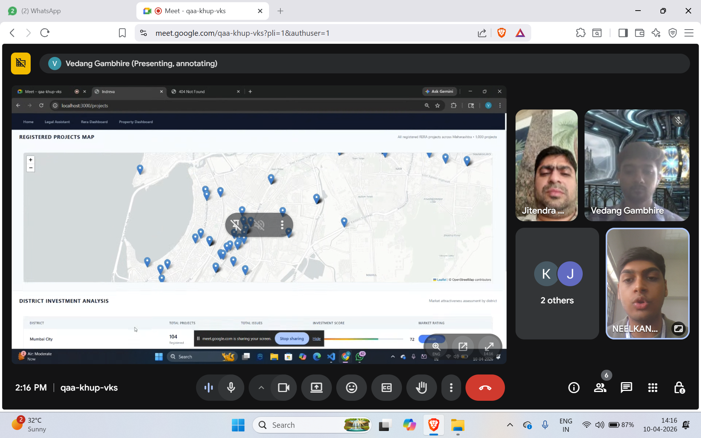

###### **Figure 2\.** Geospatial Data Visualization Demonstration {#figure-2.-geospatial-data-visualization-demonstration}

During the functional walkthrough, the Registered Projects Map was demonstrated. This feature showcases a live integration of geospatial data, plotting real estate projects across a map interface. The demonstration highlighted the 'District Investment Analysis' tool, which provides a granular look at investment scores and market ratings for specific regions like Mumbai City.  
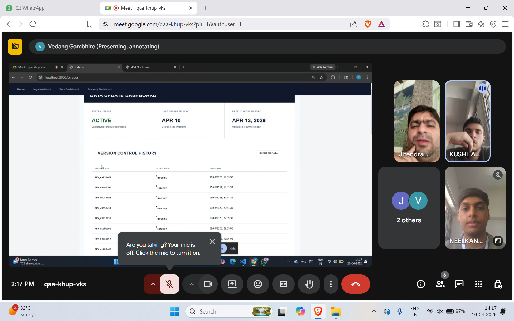

###### **Figure 3\.** System Health & Version Control Demonstration {#figure-3.-system-health-&-version-control-demonstration}

The demonstration transitioned to the administrative side of the platform, highlighting the Data Update Dashboard. This section proved the system's ability to maintain real-time data syncs and displayed a transparent 'Version Control History.'  
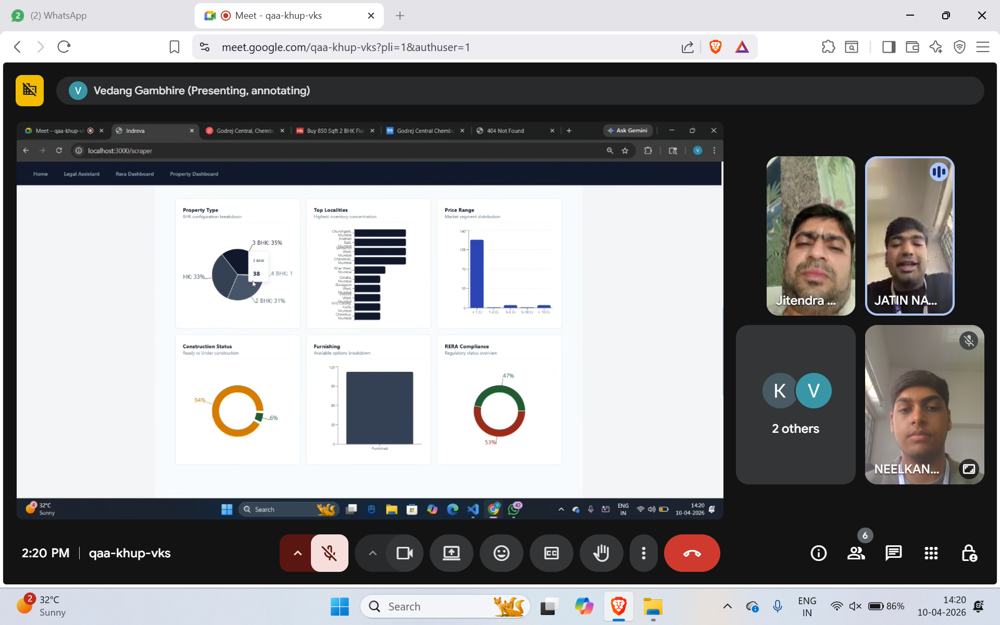

###### **Figure 4\.** Data Analytics & Insights Demonstration {#figure-4.-data-analytics-&-insights-demonstration}

The final segment of the demonstration focused on the Property Analytics Dashboard. Various data visualization components were presented, including pie charts for 'Property Type' distribution, bar graphs for 'Top Localities,' and gauges for 'RERA Compliance.' This session illustrated how raw data is converted into actionable business intelligence for the end-user.

## **2.3 Patents** {#2.3-patents}

### **Patent: US20220327643A1** {#patent:-us20220327643a1}

* Year: 2022 (Published: Oct 2022\)  
* Title: Property Recommendation System, Methods, and Apparatus  
* Summary:  
  This patent introduces a machine learning–based property recommendation system that creates a dynamic user preference profile. It analyzes user behavior, lifestyle, demographics, and preferences to classify users (e.g., buyer, renter, investor). Using these profiles, the system recommends properties tailored to individual needs. It continuously updates recommendations based on user feedback and life changes, enabling personalized and evolving property suggestions rather than static listings.

### **Patent: US20260017736**  {#patent:-us20260017736}

* Year: 2026 (Patent granted Feb 10, 2026; filed earlier)  
* Title: Decision Support Tool for Selecting Properties  
* Summary:  
  This patent presents a decision-support system for real estate selection using data analytics, machine learning, and large language models (LLMs). It evaluates properties based on multiple factors such as spatial, financial, risk, and temporal data. The system creates user vectors and property vectors to match users with suitable properties and provides features like dashboards, comparisons, market insights, and real-time visualization (including video data). It aims to simplify complex home-buying decisions by offering comprehensive, personalized, and data-driven recommendations.

# **Chapter 3 Requirement of Proposed System** {#chapter-3-requirement-of-proposed-system}

## **3.1 Functional Requirements** {#3.1-functional-requirements}

The functional requirements describe the core functionalities that the proposed system must perform.

1. The system shall allow users to search properties using natural language queries. It shall interpret user intent and convert queries into structured filters such as location, budget, and property type.  
2. The system shall extract property data from multiple real estate platforms using web scraping. It shall collect attributes such as price, location, BHK type, and source website.  
3. The system shall perform data pre-processing and normalization by cleaning raw data, removing duplicate entries, and converting unstructured data into a structured format.  
4. The system shall store processed property data in a centralized database to enable efficient querying and retrieval.  
5. The system shall match user queries with relevant property listings and filter results based on constraints such as budget, location, and configuration.  
6. The system shall allow comparison of properties across different platforms and display variations in pricing for similar properties to help identify the best available deal.  
7. The system shall analyze property prices and rank listings based on affordability and value, highlighting comparatively better-priced properties.  
8. The system shall provide a legal information retrieval feature where users can ask queries related to real estate laws. The system shall retrieve relevant information from RERA documents and generate simplified responses.  
9. The system shall validate property details using regulatory data by cross-checking listings with RERA records and indicating project registration status.  
10. The system shall provide a dashboard for visualization of property data, including price comparisons and listing distributions.  
11. The system shall provide a user interface that supports property search, comparison, and legal query interaction in a unified system.

## **3.2 Non-Functional Requirements** {#3.2-non-functional-requirements}

The non-functional requirements define the quality attributes and performance criteria of the proposed system.

1. The system shall provide fast response time for user queries, ensuring that search results and analysis are displayed with minimal delay.  
2. The system shall be scalable to handle increasing volumes of property data and user queries without significant performance degradation.  
3. The system shall ensure data accuracy by performing proper data cleaning, validation, and normalization during preprocessing.  
4. The system shall maintain reliability by ensuring consistent system performance and availability during operation.  
5. The system shall provide usability through a simple and intuitive user interface, allowing users to easily perform searches, comparisons, and queries.  
6. The system shall ensure maintainability by using modular design and structured code, enabling easy updates and enhancements.  
7. The system shall support interoperability by integrating data from multiple external real estate platforms and regulatory sources.  
8. The system shall ensure data consistency across different modules such as scraping, storage, and analysis.  
9. The system shall handle errors gracefully by providing appropriate messages and fallback mechanisms in case of failures.  
10. The system shall ensure efficient storage and retrieval of data using optimized database structures.  
11. The system shall support portability by allowing deployment across different environments with minimal configuration changes.

## **3.3 Constraints** {#3.3-constraints}

The constraints define the limitations and restrictions under which the proposed system operates.

1. The system depends on external real estate websites for data collection, and changes in their structure may affect the scraping process.  
2. The availability and accuracy of data are limited to what is provided by third-party platforms and regulatory sources.  
3. The system may face restrictions such as rate limits or anti-scraping mechanisms while accessing data.  
4. The performance of the system is constrained by available hardware resources such as processing power and memory.  
5. The accuracy of natural language processing depends on the quality of user input and may not always correctly interpret intent.  
6. The system requires a stable internet connection for data fetching and updates.  
7. The implementation is limited by project timeline and available development resources. 

## **3.4 Hardware & Software Requirements** {#3.4-hardware-&-software-requirements}

### **Hardware Requirements** {#hardware-requirements}

| Sr. No. | Component | Specification | Use |
| ----- | ----- | ----- | ----- |
| 1 | Processor | Intel Core i5-11320H or higher | Executes data processing, LLM inference, and overall system operations |
| 2 | RAM | Minimum 8 GB | Supports in-memory operations for embeddings, vector search, and model execution |
| 3 | Storage | Minimum 256 GB HDD/SSD | Stores datasets, PDF documents, embeddings, and project files |
| 4 | System Type | 64-bit Operating System | Ensures compatibility with modern frameworks, Node.js, and AI tools |
| 5 | Network | Stable Internet Connection | Required for data collection (web crawling), API access, and dependency installation |

### **Software Requirements** {#software-requirements}

| Sr. No. | Software/Tool | Version / Specification | Description / Use |
| ----- | ----- | ----- | ----- |
| 1 | Operating System | 64-bit OS (Windows/Linux/macOS) | System environment used for executing all experiments |
| 2 | Hardware | Intel Core i5-11320H, 8 GB RAM | Computational setup used for running models and pipelines |
| 3 | Runtime Environment | Node.js v24.13.1 | Backend runtime used for executing scripts and framework logic |
| 4 | Package Manager | npm v11.8.0 | Dependency management and installation of required libraries |
| 5 | Programming Language | JavaScript (Node.js), Python | JavaScript for RAG pipeline; Python for data crawling and preprocessing |
| 6 | Framework | LangChain v1.2.33 | Core framework for building RAG pipeline, chunking, retrieval, and LLM orchestration |
| 7 | LLM Interface | Ollama v0.20.2 | Used for running and managing local LLMs |
| 8 | Embedding Model | embeddinggemma:300m | Generates vector embeddings for semantic search |
| 9 | Chat Model | qwen2.5:0.5b | Used for legal query answering with deterministic outputs |
| 10 | Agentic Model | llama3.2:3b | Used for ReAct-based property search and reasoning tasks |
| 11 | Vector Database | faiss-node v0.5.1 | Stores embeddings and performs similarity search |
| 12 | PDF Processing Library | pdf-parse v2.4.5 | Extracts text from legal PDF documents |
| 13 | Text Chunking | RecursiveCharacterTextSplitter v1.0.1 | Splits documents into semantic chunks with overlap |
| 14 | Data Crawling Library | Crawl4AI v0.8.x | Extracts property data from websites like 99acres, MagicBricks |
| 15 | Validation Library | Zod | Ensures structured and schema-validated outputs |
| 16 | Prompt Engineering | PromptTemplate (LangChain) | Controls LLM behavior and ensures domain-specific responses |
| 17 | Database / Storage | CSV / JSON (Local Storage) | Stores structured datasets for property and risk analysis |
| 18 | Frontend | HTML, CSS, JavaScript | User interface for interaction with the system |
| 19 | APIs / Networking | Requests / HTTP Libraries | Used for fetching external data where required |

## **3.5 Techniques utilized till date for the proposed system** {#3.5-techniques-utilized-till-date-for-the-proposed-system}

The system utilizes Retrieval-Augmented Generation (RAG) to enable context-aware legal information retrieval from unstructured real estate documents. This approach combines semantic search with large language models to generate accurate and grounded responses. To process unstructured PDF data, a text extraction and semantic chunking technique is used, where documents are divided into overlapping chunks to preserve contextual continuity. This is followed by vector embedding generation, enabling efficient similarity-based retrieval of relevant legal content. For property discovery, the system incorporates an Agentic AI framework based on the ReAct (Reasoning and Acting) paradigm, which allows the model to iteratively refine queries and interact with structured datasets through custom tools. Additionally, rule-based parsing and regex matching techniques are used to convert unstructured scraped data into structured formats. In the risk scoring module, the system employs statistical modeling techniques, including Bayesian smoothing to handle sparse data scenarios and weighted multi-dimensional risk aggregation to compute district-level risk scores. A cross-signal amplification strategy is also applied to highlight high-risk scenarios where multiple risk indicators overlap.

## **3.6 Tools utilized till date for the proposed system** {#3.6-tools-utilized-till-date-for-the-proposed-system}

The proposed system was developed and tested on a 64-bit computing environment using Node.js v24.13.1 as the primary runtime, along with npm v11.8.0 for efficient package management and dependency handling. The core architecture of the system was built using LangChain v1.2.33, which enabled the implementation of a structured Retrieval-Augmented Generation (RAG) pipeline, including document chunking, embedding generation, and retrieval workflows. For managing and running local large language models (LLMs), Ollama v0.20.2 was utilized, providing a seamless interface for model deployment and inference. In the document processing phase, the pdf-parse library (v2.4.5) was used to extract textual content from unstructured PDF documents, while RecursiveCharacterTextSplitter (v1.0.1) from LangChain was employed to divide the extracted text into semantically meaningful chunks with controlled overlap. For vector storage and similarity-based retrieval, faiss-node v0.5.1 was used as the vector database, enabling efficient embedding indexing and search operations. The system integrates multiple locally hosted models, including embeddinggemma:300m for generating vector embeddings, qwen2.5:0.5b for legal query answering with deterministic outputs, and llama3.2:3b for agentic reasoning in the property discovery framework. PromptTemplate (LangChain) was used to control model behavior and ensure domain-specific responses, while Zod was utilized for schema validation to enforce structured and reliable outputs. Additionally, data acquisition for the property discovery module was performed using Crawl4AI (v0.8.x), which enabled web crawling and extraction of property listings from multiple platforms. The processed data was stored in structured formats such as CSV and JSON for efficient querying and analysis. The frontend of the system was developed using standard web technologies, including HTML, CSS, and JavaScript, enabling user interaction with the underlying AI-powered system.

## **3.7 Project Proposal** {#3.7-project-proposal}

The proposed system aims to develop an intelligent real estate assistance platform that integrates legal information retrieval, property discovery, and risk assessment into a single framework. It addresses key challenges faced by users in understanding complex legal documents, finding suitable properties, and evaluating investment risks.  
The system consists of three main components. The first is a legal information retrieval module based on Retrieval-Augmented Generation (RAG), which enables users to query real estate laws and regulations in natural language and receive accurate, context-based responses. The second is a natural language property discovery module that uses agentic AI to convert user queries into structured database searches and provide personalized property recommendations. The third component is a district-wise risk scoring module that analyzes regulatory data to generate risk scores for different regions, helping users make informed investment decisions. By combining NLP, AI, and data-driven techniques, the system provides a comprehensive and user-friendly solution for real estate decision-making.

# **Chapter 4 Proposed Design** {#chapter-4-proposed-design}

## **4.1 Block Diagram Representation of the Proposed System** {#4.1-block-diagram-representation-of-the-proposed-system}

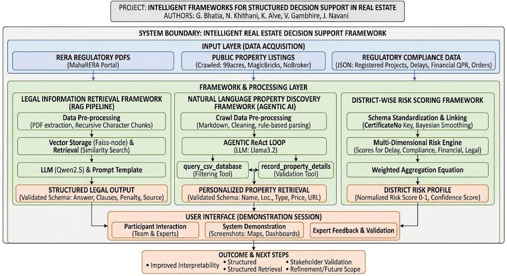

###### **Figure 5\.** Block Diagram of the Proposed Framework {#figure-5.-block-diagram-of-the-proposed-framework}

This block diagram illustrates a multi-layered Intelligent Real Estate Decision Support Framework designed to automate property and regulatory analysis. The Input Layer collects data from RERA PDFs, public listings, and compliance records, which is then processed through three core engines: a RAG-based Legal Retrieval system, an Agentic AI for property discovery, and a Risk Scoring Framework for district-level analysis. These processing modules convert unstructured data into structured outputs, such as legal answers and risk profiles, which are presented through a User Interface for expert validation. The final outcome focuses on improving market transparency and decision-making through high-fidelity, structured information retrieval.

## **4.2 Modular diagram Representation of the Proposed System** {#4.2-modular-diagram-representation-of-the-proposed-system}

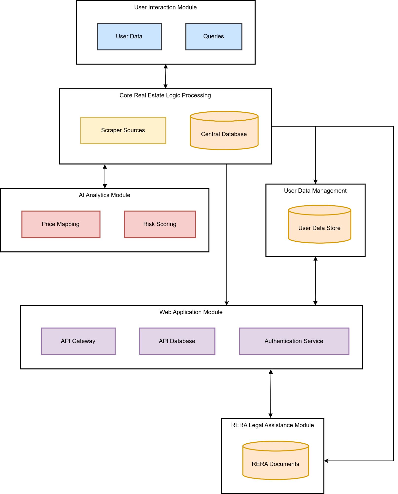

###### **Figure 6\.** Modular Diagram of the Proposed Framework {#figure-6.-modular-diagram-of-the-proposed-framework}

The diagram shows how the system is built from several specialized departments that work together. At the top, the User Interaction Module handles data and queries, passing them down to the Core Real Estate Logic which connects to a central database and various scrapers. This core logic is supported by an AI Analytics Module for price mapping and risk scoring, while a separate Web Application Module manages the technical details like security and API gateways. Finally, a dedicated RERA Legal Assistance Module stores and manages regulatory documents to ensure all advice is legally sound.

## 

## **4.3 Design of the Proposed System** {#4.3-design-of-the-proposed-system}

### **4.3.1 Data Flow Diagram** {#4.3.1-data-flow-diagram}

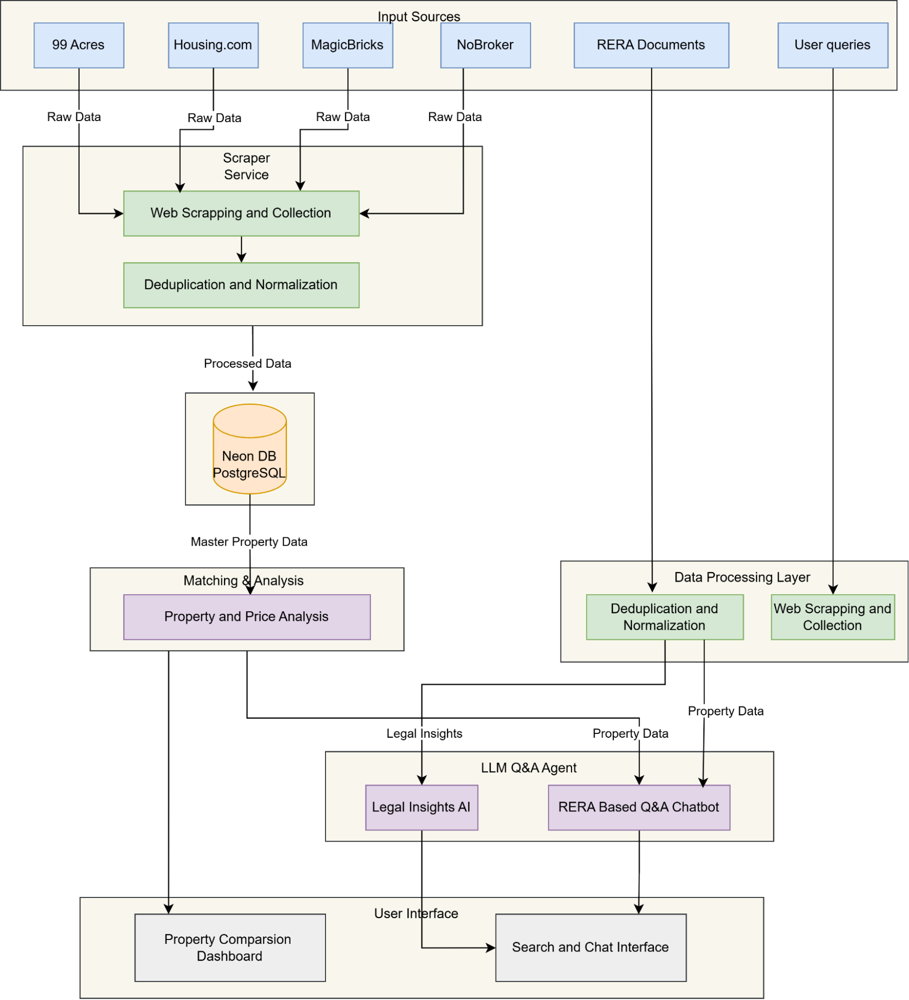

###### **Figure 7\.** Dataflow Diagram of the Proposed Framework {#figure-7.-dataflow-diagram-of-the-proposed-framework}

The diagram tracks how information actually moves from the internet to the user. Data is pulled from multiple external sources like 99Acres, Housing.com, and MagicBricks, then sent through a scraper service to be cleaned and organized. This processed data is stored in a PostgreSQL database which feeds into a matching and analysis engine. On a parallel track, legal documents and user queries are processed by an AI agent that provides RERA-based chat responses. These two paths converge at the user interface, where the person sees a property comparison dashboard and a search interface.

### 

### **4.3.2 Flowchart for the Proposed System** {#4.3.2-flowchart-for-the-proposed-system}

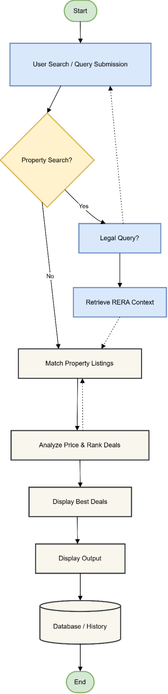

###### **Figure 8\.** Flowchart Diagram of the Proposed Framework {#figure-8.-flowchart-diagram-of-the-proposed-framework}

The diagram illustrates the step by step journey of a user interaction. It begins when a user submits a search query, at which point the system determines if they are looking for a property or asking a legal question. If it is a legal inquiry, the system retrieves relevant RERA regulatory context before proceeding. Once the intent is clear, the system matches the request against available property listings, analyzes the pricing to rank the best deals, and displays the final output to the user. All of this activity is then logged into a database history for future reference.

### 

### **4.3.3 ER Diagram** {#4.3.3-er-diagram}

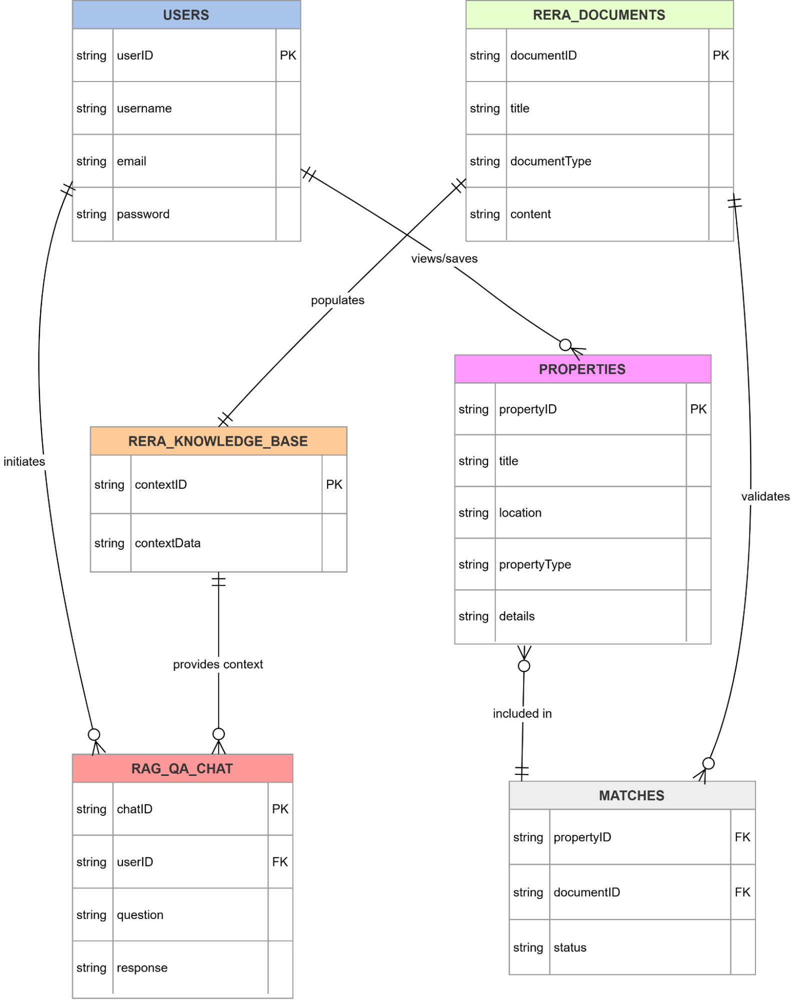

###### **Figure 9\.** ER Diagram of the Proposed Framework {#figure-9.-er-diagram-of-the-proposed-framework}

The diagram reveals the underlying structure of the database and how different pieces of information are linked together. It shows that users are the central figures who initiate chat sessions and view various property listings. These properties are categorized by their location and type, and they are cross-referenced against RERA documents to ensure they are valid. The system also maintains a RERA knowledge base that provides the necessary context for the AI to answer questions accurately, creating a web of connections that ensures every property match is backed by legal data.

## **4.4 Project Scheduling & Tracking using Gantt Chart** {#4.4-project-scheduling-&-tracking-using-gantt-chart}

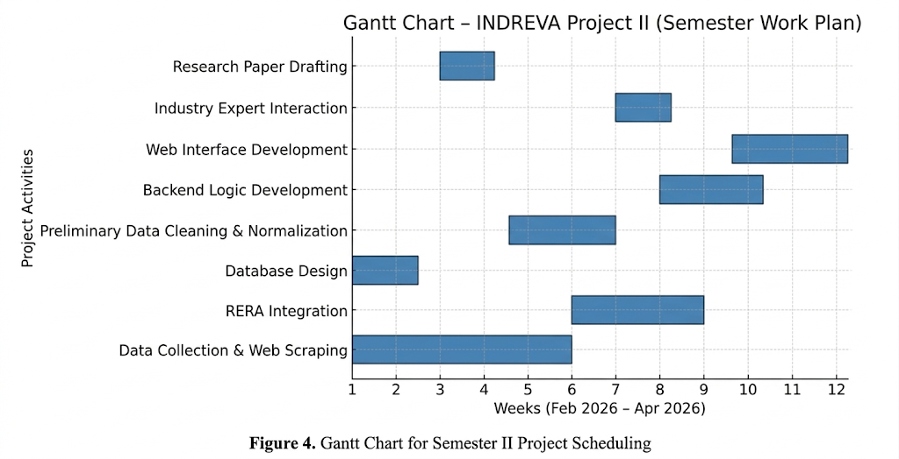  
**Figure 10\.** Project Scheduling and Tracking

# 

# **Chapter 5 Implementation of the Proposed System** {#chapter-5-implementation-of-the-proposed-system}

## **5.1 Methodology** {#5.1-methodology}

The following experiments were performed on a system equipped with an Intel Core i5-11320H CPU @ 3.20GHz and 8 GB of RAM, running on a 64-bit operating system. Node.js v24.13.1 was utilized as the runtime environment, with npm v11.8.0 for package management. The framework architecture was built using the LangChain v1.2.33. The language model interface was managed via Ollama v0.20.2 for localized LLMs. The experiments were performed individually adhering to their input data and the structured outputs are also discussed as a part of research outputs in this section.  
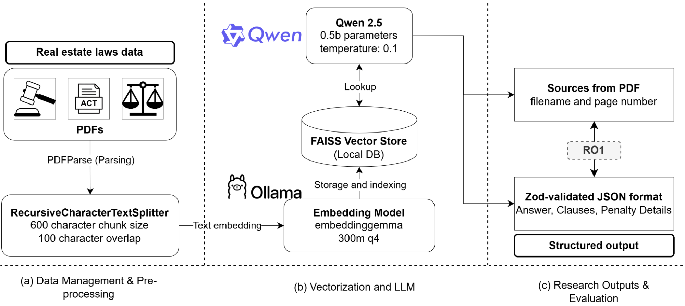

###### **Figure 11\.** Framework for Verifiable Legal Information Retrieval from Real Estate Law Data {#figure-11.-framework-for-verifiable-legal-information-retrieval-from-real-estate-law-data}

The purpose of the proposed legal information retrieval framework, implemented as a functional Retrieval-Augmented Generation (RAG) pipeline for real estate PDF documents, is designed to handle real estate legal queries. It aims to resolve the limitation of helping users interpret legal rules, compliance details, and documentation. The implementation of the framework is carried out in three phases: Data Management & Pre-processing, Vectorization and LLM, and Research Output & Evaluation.  
In the Data Management & Pre-processing phase, the input layer for this experiment was curated by downloading and normalizing the names of acts, rules, and regulation documents in PDF format, sourced directly from the official MahaRERA portal. An ingestion script was then designed to convert this unstructured PDF data into semantic character chunks. This script performed the extraction of text data from each page of the PDF document using the npm pdf-parse (v2.4.5) library by mapping between the text and original page numbering. To ensure that legal clauses remain intact, RecursiveCharacterTextSplitter (v1.0.1) from LangChain was configured with a chunk size of 600 characters and a 100-character overlap to maintain semantic continuity.  
In the Vectorization and LLM phase, the embeddinggemma:300m-qat-q4\_0 model (size: 622MB) was installed locally using Ollama to generate vector embeddings of the previously created chunks. These embeddings were stored locally using the faiss-node (v0.5.1) vector store. The vector store assigns a unique docId to every chunk, mapping it to a metadata object containing the source filename and page number. The retrieval logic was implemented to provide the model with the most relevant legal context by performing a similarity search (k \= 2\) along with page-level citations.  
In the Research Output & Evaluation phase, a chat model qwen2.5:0.5b (size: 398MB) was installed locally and used via LangChain’s ChatOllama (v1.2.6) library with a low temperature (0.1) to ensure deterministic and accurate legal output. For structured output and defining the operational boundary, the model was controlled using a specialized PromptTemplate, and its response was passed through a zod-validated schema. The schema includes answers, clauses (i.e., an array of specific legal sections or rules identified), penalty details (i.e., specific fines or penalties mentioned in the context), and sources (i.e., filenames of the PDF documents). The testing was conducted using a prompt template that positions the system as a legal assistant specializing in Maharashtra Real Estate Regulatory Authority (MahaRERA) acts, rules, and regulations, ensuring concise and professional answers based only on retrieved context. The tested input asked about penalties for delayed project registration under MahaRERA. The generated output demonstrates the framework’s ability to extract specific legal provisions and cross-reference them with their respective source documentation.

| Answer | Administrative Charges and Standard Fees |
| :---- | :---- |
| **Clause(s)** |  'The administrative charges to be retained by the Authority in cases of withdrawal of application for registration of any Real Estate Project in accordance with Rule 3 (7) of the Maharashtra Real Estate(Regulation and Development)(Registration of Real Estate Projects, estimated receivable of the project is less than the estimated cost of completion of the project.', '47. The Registration shall be valid for a period of years beginning from and ending with unless renewed by the Maharashtra Real Estate Regulatory Authority in accordance with section 5 of the Act read with rule 6; (v) The promoter shall comply with the provisions of the Act and the rules and regulations made thereunder.', 'vi) That the promoter shall take all the pending approvals from the competent authorities' |
| **Penalty Details** | If a party fails to comply with an order for costs within the permitted period, the order of the Authority awarding costs shall be executed forthwith in the same manner as a decree/order of a Civil Court. |
| **Sources** | { source: 'maharera\_general\_regulations\_2017.pdf', page: 31 }, { source: 'maharera\_project\_registration\_rules\_2017.pdf', page: 119 } |

##### **Table 1\.** Research Output of the Legal Information Retrieval Framework {#table-1.-research-output-of-the-legal-information-retrieval-framework}

The output given by the framework confirms that it can look through complicated real estate documents to provide clear legal answers. By identifying and grouping details about fees and penalties in one place, it breaks down the problem of scattered information, which often makes legal interpretation difficult for property buyers in India.  
The purpose of the proposed Natural Language Property Discovery Framework is to function as an agentic AI tool for personalized property retrieval. The implementation of this framework is carried out in three phases: Data Acquisition & Pre-processing, Agentic AI, and Research Output & Evaluation. In the Data Acquisition & Pre-processing phase, a dataset containing property listings was curated using a Python script with the Crawl4AI (v0.8.x) library, which crawled web pages from property listing websites such as 99acres, MagicBricks, and NoBroker in markdown format. The unstructured crawled data was passed through a cleaning pipeline to remove non-essential web elements such as navigational headers, advertisements, and disclaimers. After cleaning, a rule-based parsing logic was applied to extract relevant attributes and generate structured CSV files. The property\_listings.csv file contains attributes such as listing\_id (reference key to master properties), property\_id, source\_website, price (in Crores), and URL. The master\_properties.csv file contains attributes such as property\_id, canonical\_name, location, bhk\_type, and standard\_area.  
In the Agentic AI phase, the core model used was llama3.2:3b (size: 2.0GB), installed locally via Ollama. To ensure deterministic output, the model temperature was set to 0, and verbose mode was enabled to facilitate step-wise execution analysis. The agent follows a Reasoning and Acting (ReAct) loop with a maximum iteration limit of 5, allowing refinement of search parameters if initial queries fail. The model was equipped with a custom tool, query\_csv\_database, which serves as an interface between the model and the dataset. Upon receiving a natural language query, the model invokes this tool, which merges the master\_properties and property\_listings datasets, applies regex-based matching to handle linguistic variations, and performs multi-dimensional filtering across location, budget constraints, and configuration types. The output is a truncated JSON array of the top 10 relevant matches.  
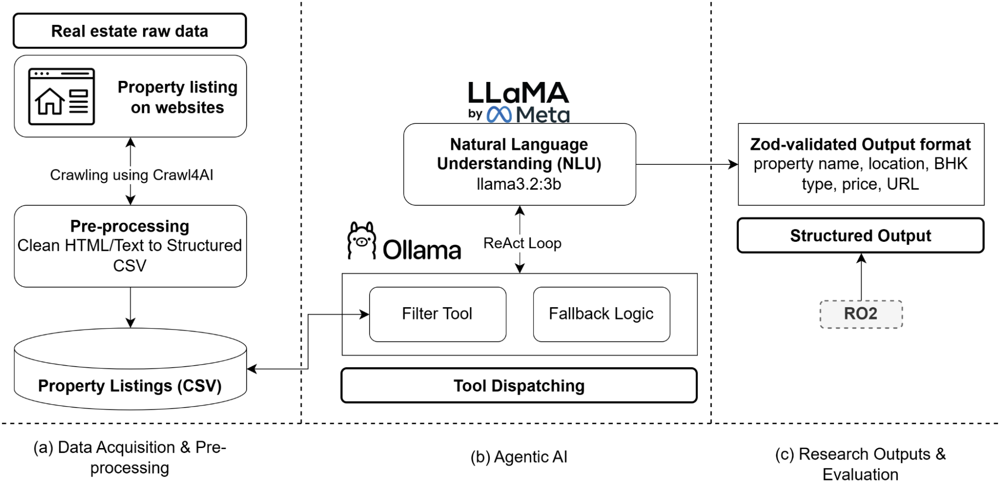

###### **Figure 12\.** Agentic Framework for Natural Language Property Discovery and Structured Data Extraction {#figure-12.-agentic-framework-for-natural-language-property-discovery-and-structured-data-extraction}

In the Research Output & Evaluation phase, the system includes another tool called record\_property\_details, which uses a zod-validated schema to map selected property attributes into a consistent, machine-readable format, thereby preventing hallucination of property details. The output includes the property name, location, BHK type, price, and URL. The framework enables users to obtain personalized property search results. Testing was conducted using a system prompt that guides the assistant to extract location, budget, and BHK requirements, use the query\_csv\_database tool for retrieval, and provide structured results. The tested input involved a user searching for a 2BHK property in Chembur with a budget of up to 2.1 Crores. The generated output demonstrates the framework’s ability to convert conversational queries into precise database filters and return validated results. It also shows how the system can transform a vague user query into a clear and actionable response.  
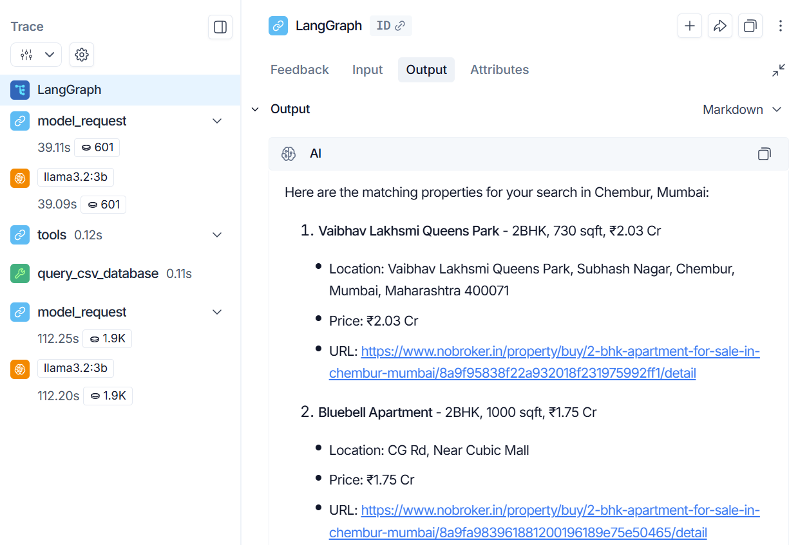

###### **Figure 13\.** Research Output of the Natural Language Property Discovery Framework and the Agentic Execution Trace {#figure-13.-research-output-of-the-natural-language-property-discovery-framework-and-the-agentic-execution-trace}

The purpose of the District-wise Risk Scoring Framework is to provide location intelligence by analyzing regulatory compliance data and project risk profiles. The implementation of this framework is carried out in three phases: Data Acquisition & Pre-processing, Risk Modeling Engine, and Research Output & Evaluation.  
 In the Data Acquisition and Preprocessing phase, the input layer utilizes five heterogeneous datasets sourced from the MahaRERA regulatory portal using Crawl4AI and converted into JSON format. These datasets include registered projects, lapse of completion dates, non-compliance with Quarterly Progress Reports (QPR), shared bank account signals, and legal authority orders. A schema standardization script was developed to perform certificate-based linking. Since project names vary across datasets, the CertificateNo was used as the primary key to link risk signals such as delays, financial irregularities, and legal orders to specific projects and their respective districts.  
In the Risk Modeling Engine phase, risk scores were computed using statistical methods. Bayesian smoothing (α \= 1, β \= 5\) was applied to prevent bias in districts with low project counts, ensuring stable comparisons. The final risk score is calculated as a weighted aggregation of four dimensions: Delay Risk (D), Compliance Risk (C), Financial Risk (F), and Legal Risk (L), along with a Cross-Signal Amplification component (S). The weights were empirically assigned based on domain relevance. Additionally, the engine identifies high-risk projects where multiple risk signals overlap and amplifies their contribution to the district’s overall score.  
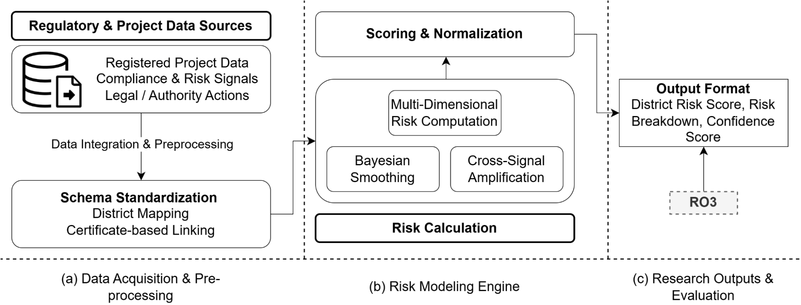

###### **Figure 14\.** Framework for District-wise Risk Scoring Framework {#figure-14.-framework-for-district-wise-risk-scoring-framework}

Research Output & Evaluation: The output provides a normalized Risk Score (0-1) and a Confidence Score for each district in Maharashtra. This framework shows  how it can enable buyers or investors to evaluate not just a single building but the regulatory health of an entire locality. The output was as follows:

| District | Delay Risk | Compliance Risk | Financial Risk | Legal Risk | Risk Score | Confidence |
| :---: | :---: | :---: | :---: | :---: | :---: | :---: |
| Pune | 197 | 63.5 | 11.333 | 0.167 | 1 | 1628 |
| Nagpur | 36 | 29.833 | 3.167 | 0.167 | 0.238 | 411 |
| Nashik | 37.667 | 27.5 | 1.167 | 0.167 | 0.232 | 395 |
| ⋮ | ⋮ | ⋮ | ⋮ | ⋮ | ⋮ | ⋮ |

##### **Table 2\.** Output of the District-wise Risk Scoring Framework {#table-2.-output-of-the-district-wise-risk-scoring-framework}

The output generated by the framework is presented in Table 2\. The framework demonstrates how it utilizes MahaRERA records to compute a risk score, which can be used by investors to identify suitable zones or districts for investment.

# **Chapter 6: Testing of the Proposed System** {#chapter-6:-testing-of-the-proposed-system}

## **6.1 Test Case ID: TC-01 (Legal Document Query)** {#6.1-test-case-id:-tc-01-(legal-document-query)}

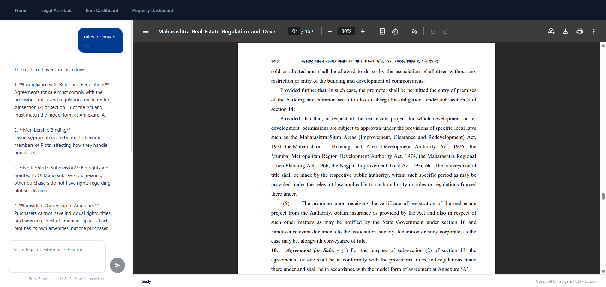

1. Objective: To evaluate the chatbot's ability to extract and summarize specific stakeholder rules from a dense legal PDF.  
2. System Input: An uploaded 152-page document titled "Maharashtra Real Estate Regulation and Development Rules."  
3. User Prompt: "rules for buyers"  
4. Execution Steps:  
   * The user uploads the PDF to the Legal Assistant dashboard.  
   * The user inputs a natural language query regarding buyer-specific rules.  
   * The system parses the document, identifies relevant clauses (Section 13, Section 10, and Annexures), and generates a response.  
5. Observed Behavior: The chatbot returned a structured four-point summary covering compliance, membership requirements, subdivision restrictions, and amenity ownership.  
6. Status: Pass (Success).  
7. Inference from Output Result:  
   1. Contextual Accuracy: The chatbot demonstrated a strong capability for Document Grounding. It correctly ignored promoter-specific obligations (seen in the middle of page 104\) to focus strictly on the buyer-centric rules requested.  
   2. Information Synthesis: The system successfully synthesized information from different parts of the document, such as linking the "Model Form at Annexure A" to the general rules for buyer compliance.  
   3. Readability and Structure: By utilizing Bold Headers and numbered lists, the AI transformed complex legal terminology into a scannable format, proving its utility as a productivity tool for non-legal professionals.  
   4. Precision in Retrieval: The output aligns perfectly with the text on the active page (Page 104/152), indicating that the RAG (Retrieval-Augmented Generation) mechanism is effectively prioritizing the visible or relevant context of the legal act.  
   5. Actionable Insights: The inference shows the chatbot does not just copy text; it interprets the *intent* of the law (e.g., clarifying that individual owners cannot claim exclusive titles to common amenity spaces).

## **6.2 Test Case ID: TC-02 (District Risk Scoring & Data Visualization)** {#6.2-test-case-id:-tc-02-(district-risk-scoring-&-data-visualization)}

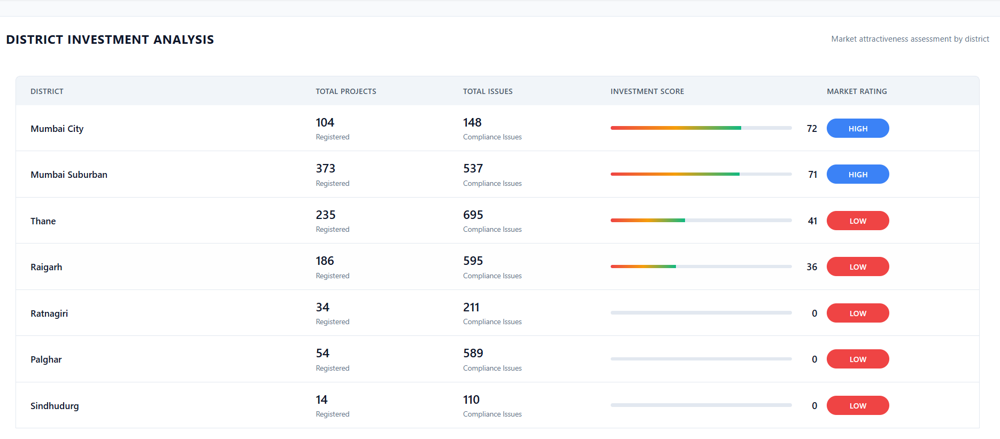

1. Objective: To verify the system's ability to aggregate district-level regulatory data and compute an "Investment Score" based on project-to-issue ratios.  
2. System Input: Multi-source dataset including registered project counts and recorded compliance issues for districts (Mumbai City, Mumbai Suburban, Thane, etc.).  
3. Execution Steps:  
   * The user navigates to the "Rera Dashboard" and selects the "District Investment Analysis" view.  
   * The backend calculation engine processes total projects against total compliance issues for each district.  
   * The system assigns a "Market Rating" (High/Low) and generates a visual color-coded Investment Score bar.  
   * The user drills down into a specific district (e.g., Mumbai Suburban) to view individual project metadata.  
4. Observed Behavior: The dashboard successfully displayed a comparative list where Mumbai City and Mumbai Suburban were rated "High" (Scores 72 and 71\) while Thane and others were rated "Low" due to high issue counts.  
5. Status: Pass.  
6. Inference from Output Result:  
   1. Inverse Relationship Correlation: The results indicate a clear inverse correlation between the number of compliance issues and the Investment Score. For example, Thane has 235 projects but a very high 695 issues, leading to a "Low" rating (Score 41), which validates the risk-weighting logic.  
   2. Granularity of Data: The transition from the high-level "Investment Analysis" to the "Registered Projects" list proves the system's ability to maintain data integrity across different scales—from district-wide scores down to specific project coordinates and certificate numbers.  
   3. Market Sentiment Indicator: By categorizing districts like Ratnagiri, Palghar, and Sindhudurg with a Score of 0, the model highlights areas where lack of transparency or high relative issues make them "Low" attractiveness zones for data-driven investors.  
   4. Geospatial Readiness: The inclusion of precise coordinates (e.g., 19.078, 72.906 for Kurla) in the project list suggests that the system is ready for integration with map-based visualization or spatial risk analysis.  
   5. Utility for Decision Support: The dashboard effectively simplifies complex regulatory data (MahaRERA compliance) into a single visual metric, significantly reducing the time required for a user to assess the risk profile of a specific geographic real estate market.

## **6.3 Test Case ID: TC-03 (Cross-Platform Price Aggregation)** {#6.3-test-case-id:-tc-03-(cross-platform-price-aggregation)}

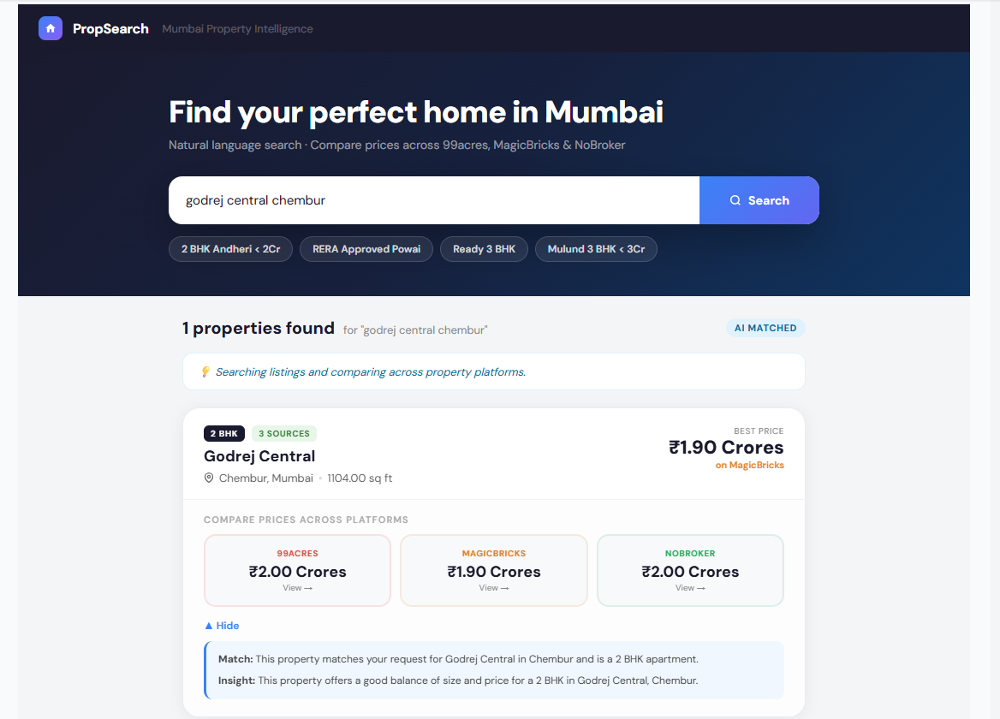

1. Objective: To verify the system's ability to process natural language queries and aggregate pricing data for the same property from multiple real estate portals (99acres, MagicBricks, NoBroker).  
2. System Input: Natural language search string "godrej central chembur".  
3. Execution Steps:  
   * The user enters a specific project name and location into the search bar.  
   * The backend triggers a distributed crawler/API call to multiple listing sites.  
   * The system identifies matching listings and extracts the current asking price from each.  
   * The AI-matching engine highlights the "Best Price" and provides an insight summary.  
4. Observed Behavior: The system identified a 2 BHK in Godrej Central and correctly pulled three different price points (₹2.00 Cr, ₹1.90 Cr, and ₹2.00 Cr), accurately identifying the MagicBricks listing as the "Best Price."  
5. Status: Pass.  
6. Inference from Output Result:  
   1. Market Transparency (Information Asymmetry Reduction): The results highlight a ₹10 lakh price discrepancy for the exact same property across different platforms. This proves the system's value in identifying cost-saving opportunities for the user that would be missed if searching a single site.  
   2. NLP Semantic Mapping: The system successfully mapped the informal query "godrej central chembur" to specific database entries for "Godrej Central" in the Chembur locality, demonstrating robust entity recognition.  
   3. AI Match Rationale: The "AI Matched" tag and subsequent insights (Size vs. Price balance) indicates the model isn't just filtering data but is actively performing multi-objective optimization (balancing square footage—1104 sq ft—against market averages).  
   4. Data Aggregation Latency & Scale: As shown in the second image, the system successfully expanded the search to 7 properties for a broader "2 bhk chembur" query, indicating the scraper can handle high-volume data retrieval without losing the "best price" comparison logic.  
   5. User Interface Efficiency: The "Why this property?" and "Insight" dropdowns suggest the system is designed to build user trust by explaining the logic behind its recommendations, rather than acting as a "black box" search engine.

# 

# **Chapter 7 Results and Discussion** {#chapter-7-results-and-discussion}

## **7.1 Screenshots of User Interface (UI)** {#7.1-screenshots-of-user-interface-(ui)}

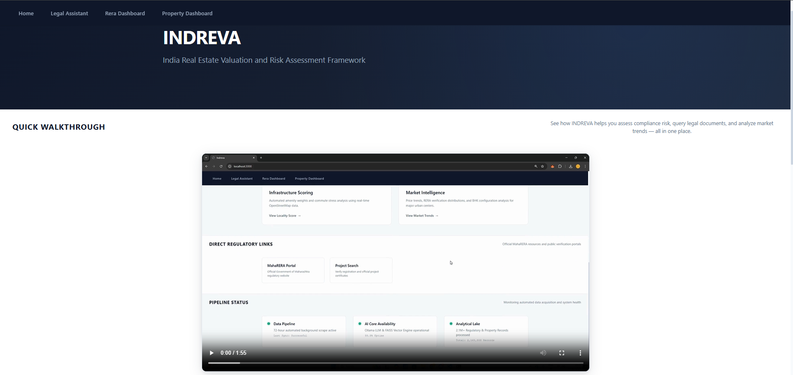  
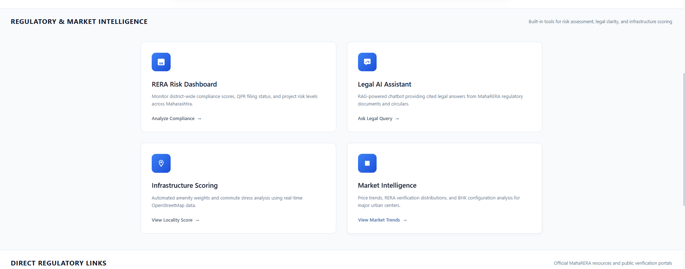

###### **Figure 15\.** Home Page of INDREVA {#figure-15.-home-page-of-indreva}

This screenshot represents the main landing page of the INDREVA platform. It provides a centralized interface for users to access various modules such as RERA Dashboard, Legal Assistant, Risk Scoring, and Market Intelligence. The design ensures easy navigation and acts as the entry point for all functionalities within the system.  
  
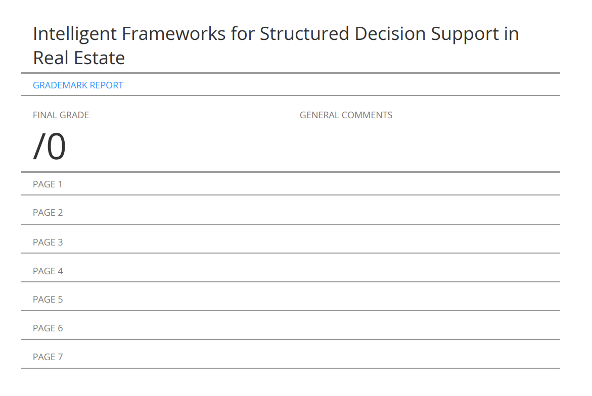

###### **Figure 16\.** Legal Assistant Implementation   {#figure-16.-legal-assistant-implementation}

This screenshot demonstrates the Legal Information Retrieval module of the system. The interface allows users to interact with a chatbot that processes queries related to real estate laws. The system retrieves relevant information from RERA documents and displays the corresponding sections in a document viewer, enabling users to understand legal regulations in a simplified and contextual manner.

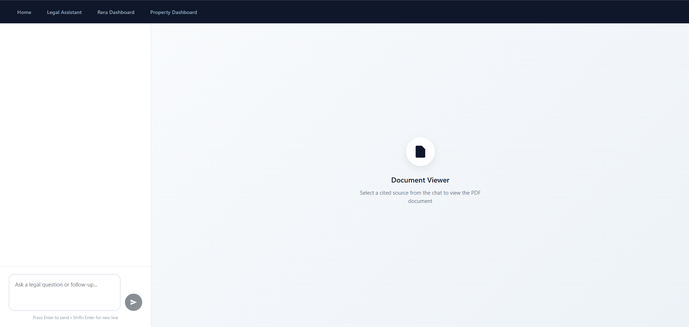  

###### **Figure 17\.** District-wise Risk Analysis Dashboard {#figure-17.-district-wise-risk-analysis-dashboard}

This screenshot represents the district-wise risk analysis module of the system. It displays risk scores for different districts based on parameters such as delay risk, compliance issues, financial irregularities, and legal factors. The dashboard helps users evaluate the safety and reliability of real estate investments across regions.   
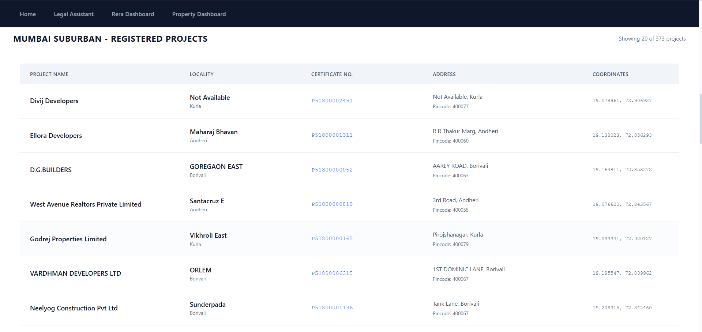

###### **Figure 18\.** Geospatial Visualization of Registered Projects {#figure-18.-geospatial-visualization-of-registered-projects}

This figure illustrates the map-based visualization of registered real estate projects. The system plots projects geographically, enabling users to analyze spatial distribution and identify high-density or high-risk areas for investment.   
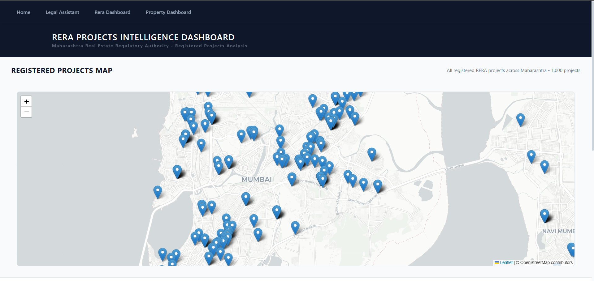

###### **Figure 19\.** Administrative Dashboard and System Monitoring  {#figure-19.-administrative-dashboard-and-system-monitoring}

This screenshot shows the administrative dashboard used for system monitoring and management. It includes features such as real-time data updates, system status tracking, and version control history, ensuring transparency and reliability of the platform.   
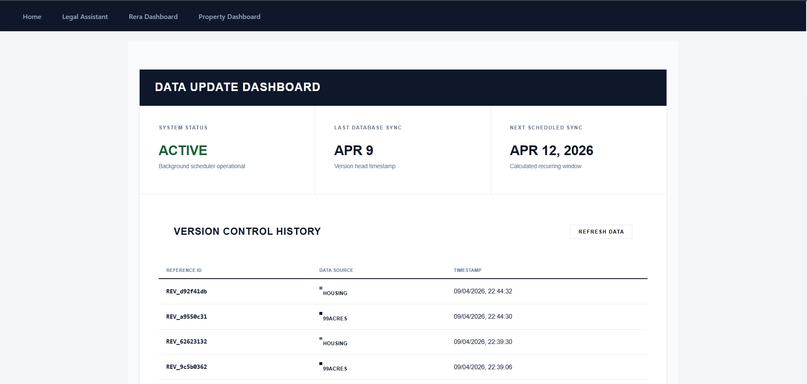

###### **Figure 20\.** Market Intelligence and Analytics Dashboard  {#figure-20.-market-intelligence-and-analytics-dashboard}

This figure presents the market analytics module, which visualizes property data using charts and graphs. It includes insights such as property type distribution, top localities, and pricing trends, helping users derive actionable intelligence from raw data.   
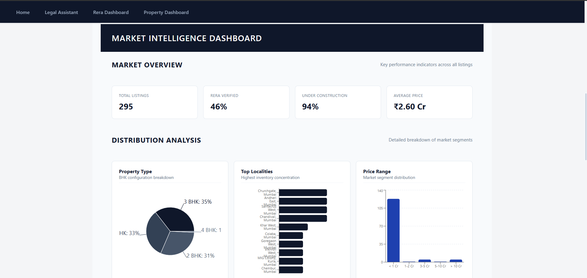

###### **Figure 21\.** Natural Language Property Search Interface {#figure-21.-natural-language-property-search-interface}

This screenshot demonstrates the natural language-based property search feature. Users can input queries in conversational form, specifying requirements such as location, budget, and property type. The system interprets these inputs and converts them into structured queries for accurate results.    
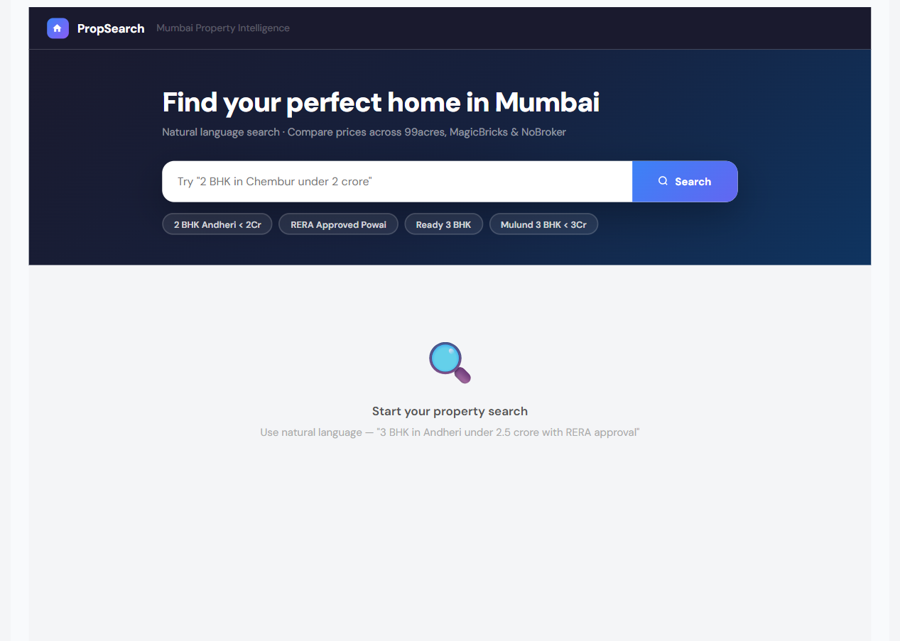

###### **Figure 22\.** Property Search Results and Listings {#figure-22.-property-search-results-and-listings}

This screenshot represents the natural language-based property search interface. Users can enter queries such as location, budget, and property type in a conversational manner. The system interprets the input and prepares it for structured processing, improving usability compared to traditional filter-based systems.

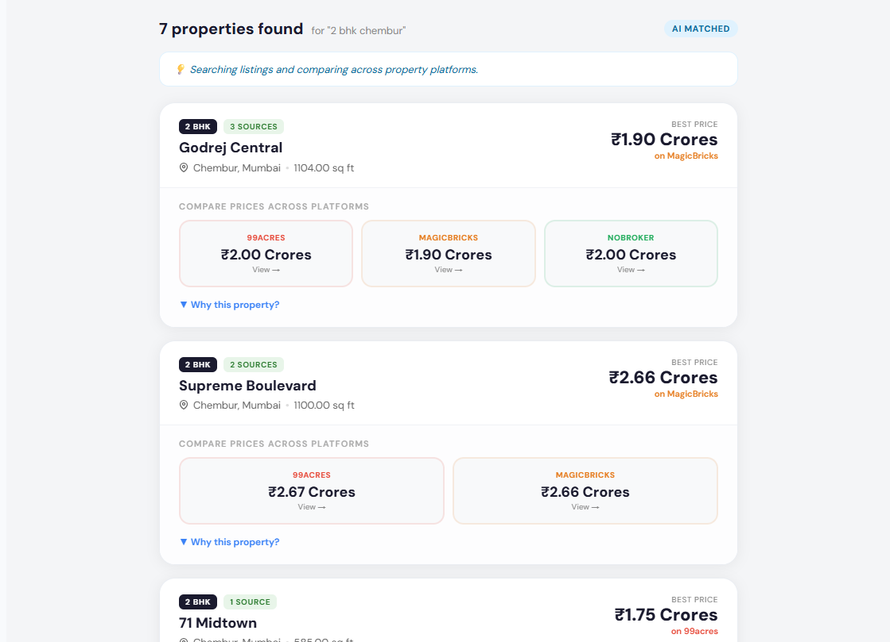

###### **Figure 23\.** Property Comparison Across Platforms {#figure-23.-property-comparison-across-platforms}

This screenshot shows the property comparison results generated by the system. Multiple listings for similar properties are displayed along with their respective prices across different platforms. This feature enables users to analyze pricing differences and make informed purchasing decisions.

# **Chapter 8 Conclusion** {#chapter-8-conclusion}

The proposed system, INDREVA: India Real Estate Valuation and Risk Assessment Framework, addresses the major challenges in the real estate domain related to fragmented information and complex decision-making. By integrating data from multiple property listing platforms and regulatory sources, the system provides a unified and structured approach to property search and analysis. The implementation of natural language-based search simplifies user interaction, allowing users to express their requirements in an intuitive manner. The system also enhances transparency by enabling property comparison across platforms and validating listings using regulatory data such as RERA. Additionally, the legal information retrieval module helps users understand complex real estate regulations in a simplified way. Overall, the system improves accessibility, reduces manual effort, and supports informed decision-making for users. It demonstrates how the integration of data processing, web scraping, and AI-based techniques can significantly enhance the real estate evaluation process.

# 

# **References** {#references}

1. Maharashtra Real Estate Regulatory Authority, "Official Website of MahaRERA," MahaRERA, 2026\. \[Online\]. Available: https://maharerait.maharashtra.gov.in/  
2. Housing.com, "Real Estate, Property in India, Buy/Sale/Rent Properties," Housing.com, 2026\. \[Online\]. Available: https://housing.com/  
3. 99acres.com, "Property in India | Buy/Sale/Rent Real Estate," 99acres.com, 2026\. \[Online\]. Available: https://www.99acres.com/  
4. MagicBricks, "Property in India: Buy/sell/rent properties," 2006\. \[Online\]. Available: https://www.magicbricks.com/  
5. NoBroker, "Zero brokerage property search portal," 2014\. \[Online\]. Available: https://www.nobroker.in/  
6. P. Eskandarpour, "How proptech platforms are reshaping discretionary power in the private rental housing market," Digital Geography and Society, vol. 8, 2025\. \[Online\]. Available: https://doi.org/10.1016/j.diggeo.2025.100147  
7. N. Karanikolas et al., "Artificial Intelligence and Real Estate Valuation: The Design and Implementation of a Multimodal Model," Information, vol. 16, no. 12, 2025\. \[Online\]. Available: https://doi.org/10.3390/info16121049  
8. K. Baur et al., "Automated real estate valuation with machine learning models using property descriptions," Expert Systems with Applications, vol. 213, 2023\. \[Online\]. Available: https://doi.org/10.1016/j.eswa.2022.119147  
9. M. K. Dehnavi et al., "Economic Analysis of the Real Estate Market Using Artificial Intelligence," IJMEA, vol. 4, no. 1, 2025\.  
10. Government of India, “Viksit India,” 2023\. \[Online\]. Available: https://viksitindia.com/  
11. NITI Aayog, “India’s Data Imperative: The Pivot Towards Quality,” Jun. 2025\. \[Online\]. Available: https://niti.gov.in/sites/default/files/2025-09/india-data-imperative-the-pivot-towards-quality.pdf  
12. Ministry of Housing and Urban Affairs, “Real Estate Regulatory Authority (RERA),” Government of India. \[Online\]. Available: https://rera.mohua.gov.in/  
13. Knight Frank India and NAREDCO, “RERA’s Reign: Charting Real Estate Growth Post-2016,” Aug. 2025\.  
14. Boston Consulting Group (BCG), “Five Years On: An Assessment of RERA,” Jul. 2021\.  
15. H. Mohd Amin et al., “Clustering analysis for classifying fake real estate listings,” PeerJ Computer Science, 2024\.  
16. C. S. Veluru, “Revolutionizing real estate: AI-driven insights from historical data,” Journal of AI & Cloud Computing, 2023\.  
17. S. M. W. Rahman et al., “Legal Query RAG: A recursive feedback mechanism,” IEEE Access, vol. 13, 2025\.  
18. S. Yao et al., “ReAct: Synergizing reasoning and acting in language models,” ICLR, 2023\.  
19. N. Khithani, “Intelligent frameworks for structured decision support in real estate,” GitHub, 2026\.  
20. Ollama, “Ollama,” 2023\. \[Online\]. Available: https://ollama.com/  
21. Crawl4AI, “Crawl4AI documentation,” 2024\. \[Online\]. Available: https://docs.crawl4ai.com/  
22. Meta AI, “Llama 3.2,” 2024\. \[Online\]. Available: https://www.llama.com/  
23. N. Khithani, “Execution trace of agentic property discovery,” LangSmith Trace Repository, 2026\.